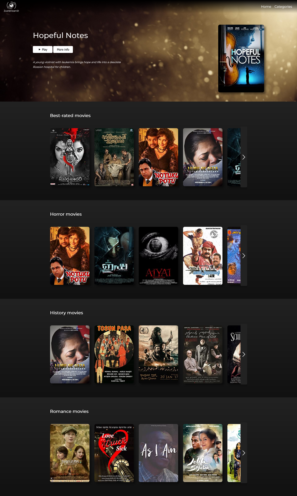

<!--suppress HtmlUnknownAnchorTarget -->

  
  

# About the project

**OpenClassrooms Python Developer Project #6: Develop a User Interface for a Python Web Application**

### Objectives

Fetch data from the [OCMovies](https://github.com/OpenClassrooms-Student-Center/OCMovies-API-EN-FR) REST API to create a Netflix-like
front page, using vanilla Javascript to build carousels and a modal.

## Post-course optimisation
This project has been optimised after the end of the OpenClassrooms course. 
To view the previously delivered version, please check [this commit](https://github.com/hmignon/P6_mignon_helene/tree/d6cc5261c1c5a995495077136405facaf50c96a9).

Improvements made to this project include:
- Using the HTML DOM to avoid repetition in html code
- Simplified modal opening process (by movie id)
- Refactoring HTML, CSS and JS
- Improved accessibility

# Setup

Clone or download the [API OCMovies](https://github.com/OpenClassrooms-Student-Center/OCMovies-API-EN-FR).
Refer to the [documentation](https://github.com/OpenClassrooms-Student-Center/OCMovies-API-EN-FR#option-2-installation-and-execution-without-pipenv-using-venv-and-pip) 
(steps 3 to 7) to install and start the server locally.

Clone the project: `git clone https://github.com/hmignon/P6_mignon_helene.git`

# Usage

To access the page, open the `index.html` file in any web browser.

## Full page screenshot

    

